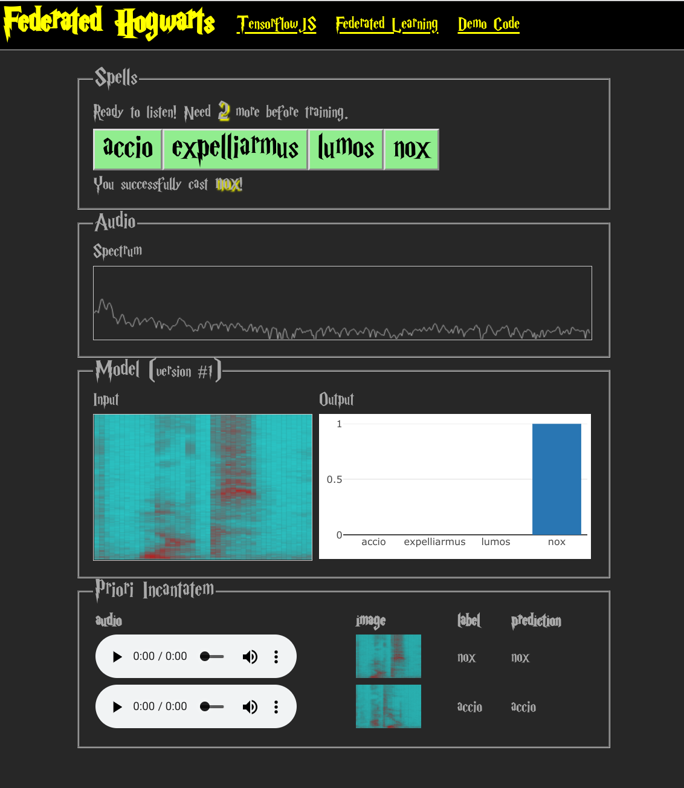
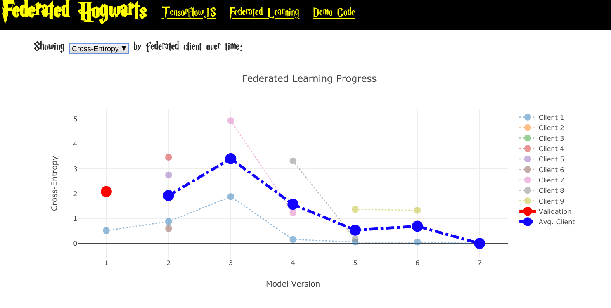

# Federated Hogwarts Demo

In this demo, we use federated learning to recognize Harry Potter spells (and cast them)!

## Running the App

Assuming you have [yarn](https://yarnpkg.com/en/) installed, simply clone the repository, `cd` into the [server](./server) directory, and run

```sh
yarn && yarn dev
```

You should then be able to navigate to `localhost:3000` and start casting! You can also navigate to `localhost:3000/results.html` to see your progress.

## Screenshots




